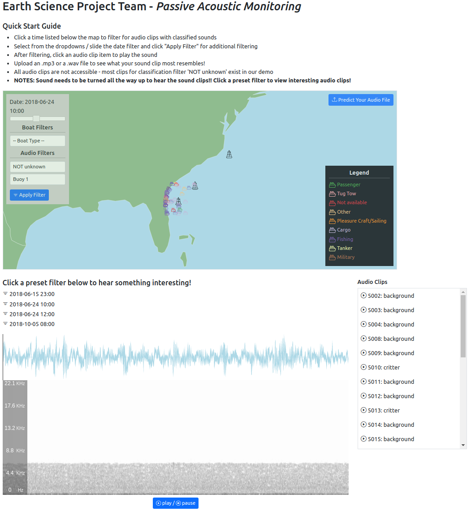

# Marine-Mammal-Acoutics
Marine Acoustics project

## Motivation

The world's oceans are one of Earths most unexplored regions even today. Since their creation in the mid-1950's (Howe et al.) Passive Acoustic Monitoring (PAM) systems have allowed us to begin exploring these unknown parts of the ocean. Marine monitoring has occurred all over the globe (Haplin et al.), primarily as a method of determining what biota are present in the area (Browning et al.). PAM systems are beneficial because they can gather continuous data from multiple locations over a large amount of time without constant supervision. This type of monitoring has allowed researchers to determine populations of endangered species (Jaramillo-Legorreta et al.), generate a picture of the overall ecology of an area over time (Kaplan et al.), and establish the impacts human involvement has had on surrounding species (Tournadre et al.)(Schoeman et al.)(Kvadsheim et al.)(Cates et al.). Although many of the aforementioned papers are well done, they lack aggregation of multiple sources to provide a greater value than the sum of their parts. Additionally, while some of these studies have involved real-time analysis of sound signal (Baumgartner M et al.)(Baumgartner et al. 2019) most are short term or were not accessible to the public. None had interactive displays where a user can listen to the sounds being produced, either currently or historically (Johnson et al).

Our project is an attempted state-of-the-art application that combines a variety of data and allows users from a wide variety of education backgrounds to make use of it. We allow users to analyze spectograms visually from our database of audio files. We map acoustic boat data and its source onto a map to give spatial references of sounds that come from the ocean. On top of this we built a classification neural network model that is able to identify whether acoustic data is Artificially generated from say a boat, oil rig, or something else human-generated or whether the acoustics are something that is generated by an animal (dolphin, boat, whales, etc.).

## Executing Exmamples
* NOTE * If you do not have the `make` utility program for running the commands in the Makefile, install make first or execute the 'command without make'.

All commands are to be run from the root directory:

command with make:      `make run-server`

command without make:   `docker-compose --project-directory web_server up --build`

This will build and run a local django web server hosted locally on docker, accessible through a browser at localhost:8000

command with make:      `make process-audio`

command without make:   `docker-compose --project-directory web_server run server python audio_processing/DataLoader.py process-data`

This runs the full data processing pipeline on a directory with the raw audio files (.flac) and inserts the results into the database.

command with make:      `make demo`

command without make:   `docker-compose --project-directory web_server run server bash demo.sh`

This will pull a couple raw .flac audio files from a pre-selected buoy and processes the audio file in our data pipeline and outputs dataframes to display the processed data.

### Running from Docker Container
`sudo docker-compose up run-server`

### Setup Environment locally
#TODO

### Required Software 
- docker
- docker-compose

## License
A short snippet describing the license (MIT, Apache etc)

MIT © [Andrew Bartels]
      [Gabriel Shindnes]
      [Jessie Gorges]
      [Hunter Clark]
      [Jeff Louie]()
